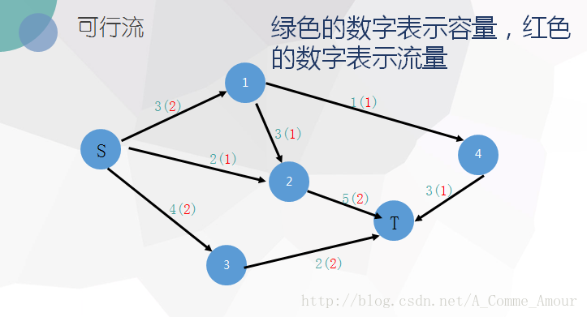
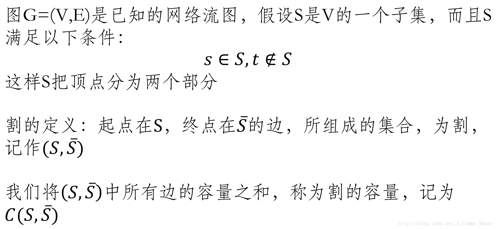

# 前言

Me : 这篇网络流的一篇介绍是我从洛谷题解里面看到的，蛮不错，原网址是[戳我](https://blog.csdn.net/A_Comme_Amour/article/details/79356220)，经过了我的一下整理，也希望可以有一些帮助吧。

Original website : 学一个新算法，总要翻多而杂的blog，收获不多。所以我就致力于把学习笔记总结，希望一遍看懂。 [简单入门](http://blog.csdn.net/wzw1376124061/article/details/55001639) （但是不全）

# 一、从概念入手

------

[网络流](https://baike.baidu.com/item/%E7%BD%91%E7%BB%9C%E6%B5%81/2987528?fr=aladdin#4)用于解决流量问题

**网络流**:所有弧上流量的集合f={f(u,v)},称为该容量网络的一个网络流.

- 定义：带权的有向图G=(V,E)，满足以下条件，则称为网络流图(flow network)：

  1. 仅有一个入度为0的顶点s，称s为源点
  2. 仅有一个出度为0的顶点t，称t为汇点
  3. 每条边的权值都为非负数，称为该边的容量，记作c(i,j)。

  弧的流量:通过容量网络G中每条弧< u,v>,上的实际流量(简称流量),记为f(u,v);

## 性质

对于任意一个时刻，设f(u,v)实际流量，则整个图G的流网络满足3个性质：

1. 容量限制：对任意u,v∈V，f(u,v)≤c(u,v)。
2. 反对称性：对任意u,v∈V，f(u,v) = -f(v,u)。从u到v的流量一定是从v到u的流量的相反值。
3. 流守恒性：对任意u，若u不为S或T，一定有∑f(u,v)=0，(u,v)∈E。即u到相邻节点的流量之和为0，因为流入u的流量和u点流出的流量相等，u点本身不会”制造”和”消耗”流量。

**可行流**:在容量网络G中满足以下条件的网络流f,称为可行流.

```c++
a.弧流量限制条件:0 <= f(u, v) <= c(u, v);
b:平衡条件:即流入一个点的流量要等于流出这个点的流量,(源点和汇点除外).
```

 

上图中的可行流即为（2+1+2=）**5**

**零流** 若网络流上每条弧上的流量都为0,则该网络流称为零流. 
**伪流**:如果一个网络流只满足弧流量限制条件,不满足平衡条件,则这种网络流为伪流,或称为容量可行流.(预流推进算法有用)

###### 最大流最小割定理:

在容量网络中,满足弧流量限制条件,且满足平衡条件并且具有最大流量的可行流,称为网络最大流,简称最大流.

## 最大流

对于网络流图G，流量最大的可行流f，称为最大流

##### **弧**的类型:

1. a.饱和弧:即f(u,v)=c(u,v);
2. b.非饱和弧:即f(u,v) < c(u,v)；
3. c.零流弧:即f(u,v)=0;
4. d.非零流弧:即f(u,v)>0.

最大流最小，可行流为最大流，当且仅当不存在新的增广路径。

##### **链**:

在容量网络中,称顶点序列(u1,u2,u3,u4,..,un,v)为一条链要求相邻的两个顶点之间有一条弧.

设P是G中一条从Vs到Vt的链,约定从Vs指向Vt的方向为正方向.**在链中并不要求所有的弧的方向都与链的方向相同**.

##### **割**



**无向图的割集(Cut Set)**:C[A,B]是将图G分为A和B两个点集 A和B之间的边的全集 
**网络的割集**:C[S,T]是将网络G分为s和t两部分点集 S属于s且T属于t 从S到T的边的全集 
**带权图的割(Cut)**：就是割集中边或者有向边的权和

> 通俗的理解一下: 割集好比是一个恐怖分子 把你家和自来水厂之间的水管网络砍断了一些 然后自来水厂无论怎么放水 水都只能从水管断口哗哗流走了 
> 你家就停水了 割的大小应该是恐怖分子应该关心的事 毕竟细管子好割一些 而最小割花的力气最小


## 增广路:

如果一个可行流不是最大流，那么当前网络中一定存在一条增广路 
什么是增广路？ 
预备：

- 前向弧:(方向与链的正方向一致的弧),其集合记为P+.
- 后向弧:(方向与链的正方向相反的弧),其集合记为P-.

设f是一个容量网络G中的一个可行流,P是从Vs到Vt 的一条链,若P满足以下条件:

* P中所有前向弧都是非饱和弧.

* P中所有后向弧都是非零弧.

则称P为关于可行流f 的一条**增广路**.

沿这增广路改进可行流的操作称为**增广**.

只看文字看不懂，结合几张图： 
 


### 残留容量

给定容量网络G(V,E),及可行流f,弧< u,v>上的残留容量记为cl(u,v)=c(u,v)-f(u,v).每条弧上的残留容量表示这条弧上可以增加的流量.因为从顶点u到顶点v的流量减少,等效与从顶点v到顶点u的流量增加,所以每条弧< u,v>上还有一个反方向的残留容量cl(v,u)=-f(u,v).

### 残余网络 (Residual Network)

在一个网络流图上，找到一条源到汇的路径（即找到了一个流量）后，对路径上所有的边，其容量都减去此次找到的量，对路径上所有的边，都添加一条反向边，其容量也等于此次找到的流量，这样得到的新图，就称为原图的“残余网络”

## 费用流


### 最小费用最大流

下面介绍网络流理论中一个最为重要的定理 
最大流最小割定理(Maximum Flow, Minimum Cut Theorem): 
**网络的最大流等于最小割**

> 具体的证明分三部分 
> 1.任意一个流都小于等于任意一个割 这个很好理解 自来水公司随便给你家通点水 构成一个流 恐怖分子随便砍几刀 砍出一个割 由于容量限制 每一根的被砍的水管子流出的水流量都小于管子的容量 每一根被砍的水管的水本来都要到你家的 现在流到外面 加起来得到的流量还是等于原来的流 
> 管子的容量加起来就是割 所以流小于等于割 由于上面的流和割都是任意构造的 所以任意一个流小于任意一个割 
> 2.构造出一个流等于一个割 当达到最大流时 根据增广路定理 残留网络中s到t已经没有通路了 否则还能继续增广 我们把s能到的的点集设为S 不能到的点集为T 构造出一个割集C[S,T] S到T的边必然满流 否则就能继续增广 这些满流边的流量和就是当前的流即最大流 
> 把这些满流边作为割 就构造出了一个和最大流相等的割 
> 3.最大流等于最小割 设相等的流和割分别为Fm和Cm 则因为任意一个流小于等于任意一个割 任意F≤Fm=Cm≤任意C 定理说明完成，证明如下： 对于一个网络流图G=(V,E)，其中有源点s和汇点t，那么下面三个条件是等价的： 
> \1. 流f是图G的最大流 
> \2. 残留网络Gf不存在增广路 
> \3. 对于G的某一个割(S,T)，此时f = C(S,T) 首先证明1 => 2：
>
> 我们利用反证法，假设流f是图G的最大流，但是残留网络中还存在有增广路p，其流量为fp。则我们有流f’=f+fp>f。这与f是最大流产生矛盾。 
> 接着证明2 => 3：
>
> 假设残留网络Gf不存在增广路，所以在残留网络Gf中不存在路径从s到达t。我们定义S集合为：当前残留网络中s能够到达的点。同时定义T=V-S。 
> 此时(S,T)构成一个割(S,T)。且对于任意的u∈S,v∈T，有f(u,v)=c(u,v)。若f(u,v) < c(u,v)，则有Gf(u,v) > 0，s可以到达v，与v属于T矛盾。 
> 因此有f(S,T)=Σf(u,v)=Σc(u,v)=C(S,T)。 最后证明3 => 1：
>
> 由于f的上界为最小割，当f到达割的容量时，显然就已经到达最大值，因此f为最大流。 这样就说明了为什么找不到增广路时，所求得的一定是最大流。

[这篇文章](http://blog.csdn.net/mystery_guest/article/details/51910913)对理解概念也是不错的。

好了概念就讲到这里，下面看一看具体的算法

# 二、网络流常用算法

------

## 一、最大流算法

下面是所有最大流算法的**精华部分**：引入反向边 
为什么要有反向边呢？ 
 
我们第一次找到了1-2-3-4这条增广路，这条路上的delta值显然是1。于是我们修改后得到了下面这个流。（图中的数字是容量） 
 
这时候(1,2)和(3,4)边上的流量都等于容量了，我们再也找不到其他的增广路了，当前的流量是1。

但这个答案明显不是最大流，因为我们可以同时走1-2-4和1-3-4，这样可以得到流量为2的流。

那么我们刚刚的算法问题在哪里呢？问题就在于我们没有给程序一个”后悔”的机会，应该有一个不走(2-3-4)而改走(2-4)的机制。那么如何解决这个问题呢？回溯搜索吗？那么我们的效率就上升到指数级了。

而这个算法神奇的利用了一个叫做反向边的概念来解决这个问题。即每条边(I,j)都有一条反向边(j,i)，反向边也同样有它的容量。

我们直接来看它是如何解决的：

在第一次找到增广路之后，在把路上每一段的容量减少delta的同时，也把每一段上的反方向的容量增加delta。即在Dec(c[x,y],delta)的同时，inc(c[y,x],delta)

我们来看刚才的例子，在找到1-2-3-4这条增广路之后，把容量修改成如下


这时再找增广路的时候，就会找到1-3-2-4这条可增广量，即delta值为1的可增广路。将这条路增广之后，得到了最大流2。


那么，这么做为什么会是对的呢？我来通俗的解释一下吧。

事实上，当我们第二次的增广路走3-2这条反向边的时候，就相当于把2-3这条正向边已经是用了的流量给”退”了回去，不走2-3这条路，而改走从2点出发的其他的路也就是2-4。（有人问如果这里没有2-4怎么办，这时假如没有2-4这条路的话，最终这条增广路也不会存在，因为他根本不能走到汇点）同时本来在3-4上的流量由1-3-4这条路来”接管”。而最终2-3这条路正向流量1，反向流量1，等于没有流量。

##### 这就是这个算法的精华部分，利用反向边，使程序有了一个后悔和改正的机会

### （1）Edmonds-Karp算法

#### 原理

求最大流的过程，就是不断找到一条源到汇的路径，若有，找出增广路径上每一段[容量-流量]的最小值delta，然后构建残余网络，再在残余网络上寻找新的路径，使总流量增加。然后形成新的残余网络，再寻找新路径…..直到某个残余网络上找不到从源到汇的路径为止，最大流就算出来了。

先从Ford-Fulkerson算法看起？

现在假设每条边的容量都是整数。这个算法每次都能将流至少增加1。由于整个网络的流量最多不超过图中所有的边的容 
量和C，从而算法会结束 。 
这个算法实现很简单但是注意到在图中C可能很大很大 
比如说下面这张图

如果运气不好这种图会让你的程序执行200次dfs，虽然实际上最少只要2次我们就能得到最大流 
 
如何避免上述的情况发生？

在每次增广的时候，选择从源到汇的具有最少边数的增广路径,也就是说！**不是通过dfs寻找增广路径，而是通过bfs寻找增广路径。** 
这就是*Edmonds-Karp 最短增广路算法* 
已经证明这种算法的复杂度上限为**nm2** (n是点数，m是边数）

#### 代码

板子题 ：[codevs1933](http://codevs.cn/problem/1993/) [poj1273](http://poj.org/problem?id=1273)

```c++
//codevs 1993
#include<cstdio>
#include<cstring>
#include<algorithm>
#include<queue>
using namespace std;
const int INF=0x7ffffff;

queue <int> q;
int n,m,x,y,s,t,g[201][201],pre[201],flow[201],maxflow; 
//g邻接矩阵存图，pre增广路径中每个点的前驱，flow源点到这个点的流量 

inline int bfs(int s,int t)
{
    while (!q.empty()) q.pop();
    for (int i=1; i<=n; i++) pre[i]=-1;
    pre[s]=0;
    q.push(s);
    flow[s]=INF;
    while (!q.empty())
    {
        int x=q.front();
        q.pop();
        if (x==t) break;
        for (int i=1; i<=n; i++)
          //EK一次只找一个增广路 
          if (g[x][i]>0 && pre[i]==-1)
          {
            pre[i]=x;
            flow[i]=min(flow[x],g[x][i]);
            q.push(i);
          }
    }
    if (pre[t]==-1) return -1;
    else return flow[t];
}

//increase为增广的流量 
void EK(int s,int t)
{
    int increase=0;
    while ((increase=bfs(s,t))!=-1)//这里的括号加错了！Tle 
    {//迭代 
        int k=t;
        while (k!=s)
        {
            int last=pre[k];//从后往前找路径
            g[last][k]-=increase;
            g[k][last]+=increase;
            k=last;
        }
        maxflow+=increase;
    }
}

int main()
{
    scanf("%d%d",&m,&n);
    for (int i=1; i<=m; i++)
    {
        int z;
        scanf("%d%d%d",&x,&y,&z);
        g[x][y]+=z;//此处不可直接输入，要+= 
    }
    EK(1,n);
    printf("%d",maxflow);
    return 0;
}
```

### （2） Dinic算法

前面的网络流算法，每进行一次增广，都要做 一遍BFS，十分浪费。能否少做几次BFS? 
这就是Dinic算法要解决的问题

#### 原理

dinic算法在EK算法的基础上增加了分层图的概念，根据从s到各个点的最短距离的不同，把整个图分层。寻找的增广路要求满足所有的点分别属于不同的层，且若增广路为s,P1,P2…Pk,t，点v在分层图中的所属的层记为deepv，那么应满足deeppi=deeppi−1+1

Edmonds-Karp的提高余地：需要多次从s到t调用BFS，可以设法减少调用次数。 亦即：使用一种代价较小的高效增广方法。考虑：在一次增广的过程中，寻找多条增广路径。 
DFS

#### 算法流程

- 先利用BFS对残余网络分层 
  一个节点的深度，就是源点到它最少要经过的边数。 
  
- 利用BFS对残余网络分层，分完层后，利用DFS从前一层向后一层反复寻找增广路。 
  
  - 分完层后，从源点开始，用DFS从前一层向后一层反复寻找增广路(即要求DFS的每一步都必须要走到下一层的节点）。 
    因此，前面在分层时，只要进行到汇点的层次数被算出即可停止，因为按照该DFS的规则，和汇点同层或更下一层的节点，是不可能走到汇点的。
  - DFS过程中，要是碰到了汇点，则说明找到了一条增广路径。此时要增加总流量的值，消减路径上各边的容量，并添加反向边，即所谓的进行增广。
  - DFS找到一条增广路径后，并不立即结束，而是回溯后继续DFS寻找下一个增广路径。 
    回溯到哪个节点呢？ 
    回溯到的节点u满足以下条件：
    1. DFS搜索树的树边(u,v)上的容量已经变成0。即刚刚找到的增广路径上所增加的流量，等于(u,v)本次增广前的容量。(DFS的过程中，是从u走到更下层的v的)
    2. u是满足条件 1)的最上层的节点如果回溯到源点而且无法继续往下走了，DFS结束。 
       **因此，一次DFS过程中，可以找到多条增广路径。**
  - DFS结束后，对残余网络再次进行分层，然后再进行DFS当残余网络的分层操作无法算出汇点的层次（即BFS到达不了汇点）时，算法结束，最大流求出。

##### ps要求出最大流中每条边的流量，怎么办？

将原图备份，原图上的边的容量减去做完最大流的残余网络上的边的剩余容量，就是边的流量。

#### 时间复杂度

* 在普通情况下， DINIC算法时间复杂度为O(V2E) 
* 在二分图中， DINIC算法时间复杂度为O(√VE)优化

• 多路增广 
每次不是寻找一条增广路，而是在DFS中，只要可以就递归增广下去，实际上形成了一张增广网。 
• 当前弧优化 
对于每一个点，都记录上一次检查到哪一条边。因为我们每次增广一定是彻底增广（即这条已经被增广过的边已经发挥出了它全部的潜力，不可能再被增广了），下一次就不必再检查它，而直接看第一个未被检查的边。

优化之后渐进时间复杂度没有改变，但是实际上能快不少。 
实际写代码的时候要注意，head数组初始值为-1，存储时从0开始存储，这样在后面写反向弧的时候比较方便，直接异或即可。 
关于复制head的数组cur；目的是为了当前弧优化。已经增广的边就不需要再走了.

#### 代码

```c++
#include<cstdio>
#include<cstring>
#include<algorithm>
#include<queue>
using namespace std;
const int inf=1e9;

int n,m,x,y,z,maxflow,deep[500];//deep深度 
struct Edge{
    int next,to,dis;
}edge[500];
int num_edge=-1,head[500],cur[500];//cur用于复制head 
queue <int> q;

void add_edge(int from,int to,int dis,bool flag)
{
    edge[++num_edge].next=head[from];
    edge[num_edge].to=to;
    if (flag) edge[num_edge].dis=dis;//反图的边权为 0
    head[from]=num_edge;
}

//bfs用来分层 
bool bfs(int s,int t)
{
    memset(deep,0x7f,sizeof(deep));
    while (!q.empty()) q.pop();
    for (int i=1; i<=n; i++) cur[i]=head[i];
    deep[s]=0;
    q.push(s);

    while (!q.empty())
    {
        int now=q.front(); q.pop();
        for (int i=head[now]; i!=-1; i=edge[i].next)
        {
            if (deep[edge[i].to]>inf && edge[i].dis)//dis在此处用来做标记 是正图还是返图 
            {
                deep[edge[i].to]=deep[now]+1;
                q.push(edge[i].to);
            }
        }
    }
    if (deep[t]<inf) return true;
    else return false;
}

//dfs找增加的流的量 
int dfs(int now,int t,int limit)//limit为源点到这个点的路径上的最小边权 
{
    if (!limit || now==t) return limit;

    int flow=0,f;
    for (int i=cur[now]; i!=-1; i=edge[i].next)
    {
        cur[now]=i;
        if (deep[edge[i].to]==deep[now]+1 && (f=dfs(edge[i].to,t,min(limit,edge[i].dis))))
        {
            flow+=f;
            limit-=f;
            edge[i].dis-=f;
            edge[i^1].dis+=f;
            if (!limit) break;
        }
    }
    return flow;
}

void Dinic(int s,int t)
{
    while (bfs(s,t))
        maxflow+=dfs(s,t,inf);
}

int main()
{
//  for (int i=0; i<=500; i++) edge[i].next=-1;
    memset(head,-1,sizeof(head));
    scanf("%d%d",&m,&n);
    for (int i=1; i<=m; i++)
    {
        scanf("%d%d%d",&x,&y,&z);
        add_edge(x,y,z,1); add_edge(y,x,z,0);
    }
    Dinic(1,n);
    printf("%d",maxflow);
    return 0;
}
```

### （3） ISAP算法

#### 原理

ISAP（Improved Shortest Augmenting Path）(%ISA)也是基于分层思想的最大流算法。所不同的是，它省去了Dinic每次增广后需要重新构建分层图的麻烦，而是在每次增广完成后自动更新每个点的『标号』（也就是所在的层）

最短增广路算法是一种运用距离标号使寻找增广路的时间复杂度下降的算法。所谓的距离标号就是某个点到汇点的最少的弧的数量(即当边权为1时某个点的最短路径长度). 设点i的标号为d[i], 那么如果将满足d[i] = d[j] + 1, 且增广时只走允许弧, 那么就可以达到”怎么走都是最短路”的效果. 每个点的初始标号可以在一开始用一次从汇点沿所有反向的BFS求出.

#### 算法流程

1. 定义节点的标号为到汇点的最短距离;
2. 每次沿可行边进行增广, 可行边即: 假设有两个点 i, j 若 d[i] = 3, d[j] = 4, 则d[j] = d[i] + 1, 也就是从 j 到 i 有一条边.
3. 找到增广路后，将路径上所有边的流量更新.
4. 遍历完当前结点的可行边后更新当前结点的标号为 d[now] = min( d[next] , add_flow(now,next) > 0)+1，使下次再搜的时候有路可走。
5. 图中不存在增广路后即退出程序，此时得到的流量值就是最大流。

需要注意的是, 标号的更新过程首先我们要理解更新标号的目的。标号如果需要更新，说明在当前的标号下已经没有增广路可以继续走，这时更新标号就可以使得我们有继续向下走的可能，并且每次找的都是能走到的点中标号最小的那个点，这样也使得每次搜索长度最小.

#### GAP 优化

由于可行边定义为：(now,next) | h[now] = h[next]+1，所以若标号出现“断层”即有的标号对应的顶点个数为0，则说明剩余图中不存在增广路，此时便可以直接退出，降低了无效搜索。举个栗子：若结点标号为3的结点个数为0，而标号为4的结点和标号为2的结点都大于 0,那么在搜索至任意一个标号为4的结点时，便无法再继续往下搜索，说明图中就不存在增广路。此时我们可以以将 h[1]=n 形式来变相地直接结束搜索

#### 时间复杂度

渐进时间复杂度和dinic相同，但是非二分图的情况下isap更具优势。

#### 代码

当代码不能理解时，就开启DeBug自己手推一遍，有利于理解的更深刻，也有利于记忆模板（口胡

```c++
//codevs上还是WA一个点 
#include<cstdio>
#include<cstring>
#include<algorithm>
#include<iostream>
#include<queue>
using namespace std;
const int inf=1e9;

queue <int> q;
int m,n,x,y,z,maxflow,head[5000],num_edge=-1;
int cur[5000],deep[5000],last[5000],num[5000];
//cur当前弧优化； last该点的上一条边； num桶 用来GAP优化 
struct Edge{
    int next,to,dis;
}edge[500];

void add_edge(int from,int to,int dis,bool flag)
{
    edge[++num_edge].next=head[from];
    edge[num_edge].to=to;
    edge[num_edge].dis=dis;
    head[from]=num_edge;
}

//bfs仅用于更新deep 
void bfs(int t)
{
    while (!q.empty()) q.pop();
    for (int i=0; i<=m; i++) cur[i]=head[i];
    for (int i=1; i<=n; i++) deep[i]=n;
    deep[t]=0;
    q.push(t);

    while (!q.empty())
    {
        int now=q.front(); q.pop();
        for (int i=head[now]; i!=-1; i=edge[i].next)
        {
            if (deep[edge[i].to]==n && edge[i^1].dis)//i^1是为了找反边 
            {
                deep[edge[i].to]=deep[now]+1;
                q.push(edge[i].to);
            }
        }
    }
}

int add_flow(int s,int t)
{
    int ans=inf,now=t;
    while (now!=s)
    {
        ans=min(ans,edge[last[now]].dis);
        now=edge[last[now]^1].to;
    }
    now=t;
    while (now!=s)
    {
        edge[last[now]].dis-=ans;
        edge[last[now]^1].dis+=ans;
        now=edge[last[now]^1].to;
    }
    return ans;
}

void isap(int s,int t)
{
    int now=s;
    bfs(t);//搜出一条增广路
    for (int i=1; i<=n; i++) num[deep[i]]++;

    while (deep[s]<n)
    {
        if (now==t)
        {//如果到达汇点就直接增广，重新回到源点进行下一轮增广 
            maxflow+=add_flow(s,t);
            now=s;//回到源点 
        }

        bool has_find=0;
        for (int i=cur[now]; i!=-1; i=edge[i].next)
        {
            if (deep[now]==deep[edge[i].to]+1 && edge[i].dis)//找到一条增广路 
            {
                has_find=true;
                cur[now]=i;//当前弧优化
                now=edge[i].to;
                last[edge[i].to]=i;
                break;
            }
        }

        if (!has_find)//没有找到出边，重新编号 
        {
            int minn=n-1;
            for (int i=head[now]; i!=-1; i=edge[i].next)//回头找路径 
                if (edge[i].dis)
                    minn=min(minn,deep[edge[i].to]);
            if ((--num[deep[now]])==0) break;//GAP优化 出现了断层 
            num[deep[now]=minn+1]++;
            cur[now]=head[now];
            if (now!=s)
                now=edge[last[now]^1].to;
        }
    }
}

int main()
{
    memset(head,-1,sizeof(head));
    scanf("%d%d",&m,&n);
    for (int i=1; i<=m; i++)
    {
        scanf("%d%d%d",&x,&y,&z);
        add_edge(x,y,z,1); add_edge(y,x,z,0); 
    }
    isap(1,n);
    printf("%d",maxflow);
    return 0;

}
```

对于EK算法与ISAP算法的区别： 
EK算法每次都要重新寻找增广路，寻找过程只受残余网络的影响，如果改变残余网络，则增广路的寻找也会随之改变；SAP算法预处理出了增广路的寻找大致路径，若中途改变残余网络，则此算法将重新进行。EK处理在运算过程中需要不断加边的最大流比SAP更有优势。

## 二、费用流算法

现在我们想象假如我们有一个流量网络，现在每个边除了流量，现在还有一个单位费用，这条边的**费用**相当于**它的单位费用乘上它的流量**，我们要保持最大流的同时，还要保持边权最小，这就是最小费用最大流问题。 
因为在一个网络流图中，最大流量只有一个，但是“流法”有很多种，每种不同的流法所经过的边不同因此费用也就不同，所以需要用到最短路算法。 
总增广的费用就是**最短路\*总流量**

### （1）SPFA

就是把Dinic中的bfs改成spfa,再求最大流的过程中最小费用流也就求出来了。 
有许多初始化的地方容易漏易错； 
flow和dis容易混易错； 
[模板题 luoguP3381](https://www.luogu.org/problemnew/show/P3381)

```c++
#include<cstdio>
#include<cstring>
#include<algorithm>
#include<queue>
using namespace std;
const int maxn=100010;

bool vis[maxn];
int n,m,s,t,x,y,z,f,dis[maxn],pre[maxn],last[maxn],flow[maxn],maxflow,mincost;
//dis最小花费;pre每个点的前驱；last每个点的所连的前一条边；flow源点到此处的流量 
struct Edge{
    int to,next,flow,dis;//flow流量 dis花费 
}edge[maxn];
int head[maxn],num_edge; 
queue <int> q;

void add_edge(int from,int to,int flow,int dis)
{
    edge[++num_edge].next=head[from];
    edge[num_edge].to=to;
    edge[num_edge].flow=flow;
    edge[num_edge].dis=dis;
    head[from]=num_edge;
}

bool spfa(int s,int t)
{
    memset(dis,0x7f,sizeof(dis));
    memset(flow,0x7f,sizeof(flow));
    memset(vis,0,sizeof(vis));
    q.push(s); vis[s]=1; dis[s]=0; pre[t]=-1;

    while (!q.empty())
    {
        int now=q.front();
        q.pop();
        vis[now]=0;
        for (int i=head[now]; i!=-1; i=edge[i].next)
        {
            if (edge[i].flow>0 && dis[edge[i].to]>dis[now]+edge[i].dis)//正边 
            {
                dis[edge[i].to]=dis[now]+edge[i].dis;
                pre[edge[i].to]=now;
                last[edge[i].to]=i;
                flow[edge[i].to]=min(flow[now],edge[i].flow);//
                if (!vis[edge[i].to])
                {
                    vis[edge[i].to]=1;
                    q.push(edge[i].to);
                }
            }
        }
    }
    return pre[t]!=-1;
}

void MCMF()
{
    while (spfa(s,t))
    {
        int now=t;
        maxflow+=flow[t];
        mincost+=flow[t]*dis[t];
        while (now!=s)
        {//从源点一直回溯到汇点 
            edge[last[now]].flow-=flow[t];//flow和dis容易搞混 
            edge[last[now]^1].flow+=flow[t];
            now=pre[now];
        }
    }
}

int main()
{
    memset(head,-1,sizeof(head)); num_edge=-1;//初始化 
    scanf("%d%d%d%d",&n,&m,&s,&t);
    for (int i=1; i<=m; i++)
    {
        scanf("%d%d%d%d",&x,&y,&z,&f);
        add_edge(x,y,z,f); add_edge(y,x,0,-f);
        //反边的流量为0，花费是相反数 
    }
    MCMF();
    printf("%d %d",maxflow,mincost);
    return 0;
}
```

### （2）Dijstra（待更新）

## 三、最小割算法

Stoer_WagnerStoer_Wagner 算法 
首先回顾一下前面的几个定义

**割**：在一个图G（V，E）中V是点集，E是边集。在E中去掉一个边集C使得G（V，E-C）不连通，C就是图G（V，E）的一个割； 
**最小割**：在G（V，E）的所有割中，边权总和最小的割就是最小割。 
**最大流最小割定理：** 
\1. 最小割等价于最大流。 
\2. 最小割在最大流中一定是满流边，是增广路径中容量最小的边。 
\3. 一条增广路径只对应一条最小割。（如果一条增广路中两条满流且都需要割掉，那一定通过反向边分成两条增广路）

最小割在最大流中一定是满流边，其实就是S到T之间必须经过的边(不管确定与否)。只要找到一条增广路径，就必须经过一条最小割。最小割中的边饱和就再也不能找到增广路径。 
一条最小割可以对应多条增广路径，但是一条增广路径只能对应一条最小割(或最小割的可能性)。 
求最小割其实就是一条增广路径中容量最小的边，这恰好与最大流的求解是一致的。

#### 算法原理与过程

Stoer_Wagner算法是求无向图全局最小割的一个有效算法，最坏时间复杂度O(n3)，主要思想是先找任意2点的最小割，然后记录下这个最小割，再合并这2个点。这样经过n−1次寻找任意2点最小割，每次更新全局最小割，最后整张图缩成一个点，算法结束，所保存下来的最小割就是全局最小割。

Stoer−Wagner的正确性： 
设S和T是图G的2个顶点，图G的全局最小割要么是S−T的最小割，此时S和T在G的全局最小割的2个不同的子集中，要么就是G中将S和T合并得的的新图G′的全局最小割，此时S和T在G的全局最小割的同一个子集中。所以只需要不断求出当前图中任意2个点的最小割，然后合并这2个点。不断缩小图的规模求得最小割。

见图片 


#### 复杂度

算法复杂度为O(n3)。如果在prim中加堆优化，复杂度会降为O(n2logn)。

#### 代码

```c++
#include <iostream>
#include <cstdio>
#include <algorithm>
#include <cstring>
using namespace std;
const int maxn=520;
const int inf=1e9;

int n,m,mp[maxn][maxn],v[maxn],dis[maxn];
//mp图，v[i]表示i节点合并到的顶点；dis[i] i点到A集合中所有的点的长度之和 
bool vis[maxn];//是否进入集合A 

int SW(int n)
{
    int ans=inf;
    for (int i=0; i<n; i++) v[i]=i;//顶点定为自己 
    while (n>1)
    {
        int k=1,pre=0;//k保存最大dis值的下标 pre上一次选入集合的点 
        //每次使0为第一个加入的点 
        for (int i=1; i<n; i++)
        {
            dis[v[i]]=mp[v[0]][v[i]];
            if (dis[v[i]]>dis[v[k]]) k=i;
        }
        memset(vis,0,sizeof(vis));
        vis[v[0]]=1;//标记进入集合 
        for (int i=1; i<n; i++)
        {
            if (i==n-1)//最后一次加入，更新答案 
            {
                ans=min(ans,dis[v[k]]);
                for (int j=0; j<n; j++)
                {
                    mp[v[pre]][v[j]] += mp[v[j]][v[k]];
                    mp[v[j]][v[pre]] += mp[v[j]][v[k]];
                }
                v[k]=v[--n];//删除最后一个点 
            }
            vis[v[k]]=1;
            pre=k;
            k=-1;
            for (int j=0; j<n; j++)
                if (!vis[v[j]])
                { 
                    //将上一次求的k加入集合 
                    dis[v[j]]+=mp[v[pre]][v[j]];
                    if (k==-1 || dis[v[j]]>dis[v[k]])
                        k=j;
                }
        }
    }
    return ans;
}

int main()
{
    while (~scanf("%d%d",&n,&m))
    {
        memset(mp,0,sizeof(mp));
        int x,y,z;
        for (int i=1; i<=m; i++)
        {
            scanf("%d%d%d",&x,&y,&z);
            mp[x][y]+=z; mp[y][x]+=z;
        }
        printf("%d\n",SW(n));
    }
    return 0;
}
```

## 四、二分图

一个无向图是二分图的充要条件是不存在奇环。

常用技巧：棋盘图黑白染色形成二分图&&网格x-y形成二分图。

S向左侧xi连边，右侧yi向T连边。

二分图题目先转化成对应二分图模型，再对应转化为网络流。

标准建图：边权全为1。

1.最大匹配=最大流（最大匹配就是匹配边数最大）

2.最小覆盖=最小割（最小覆盖就是选择最少的点使每条边至少有一个端点被选中，选点类比割边就是最小割）

3.最大独立集=总点数-最小覆盖（最大独立集就是选择最多的点使每条边至少有一个点不被选中。独立集中不能有边，每个两点匹配只能选一点，所以把最大匹配数减去后就是答案。）

4.最小路径覆盖：在DAG找尽量少的路径，使每个节点恰好在一条路径上(点不相交)。

做法：将每个点拆开分别放入xy集合中，如果u到v有一条边，则连边u,v`，然后二分图最大匹配。

初始未匹配ans=n即每个点单独为一条路径，匹配一条说明连了两点，ans-1，所以最终ans=N-最大匹配。

5.二分图带权匹配：要求完美匹配就跑费用流，不要求完美匹配就跑流量不固定的费用流（spfa时若最短路费用对答案没贡献就返回失败）。

【最大权闭合子图】

S向正权点连边，负权点向T连边，0不管，原边全部转为正无穷（节点权值全部转到了与S、T的连边上）。

hiho 第119周 最大权闭合子图

注意：上文中后面证明中的S集是闭合子图和源点S的集合，T集是其它点和汇点T的集合！

割掉与S相邻的边就是这个点舍弃了S，成为T中的正权点(离开闭合子图)；割掉与T相邻的边就是这个点舍弃T，成为S中的负权点(进入闭合子图)。(割的值与答案密切相关)

因为每条路径必须有割，所以对于所有依赖关系要么与T相邻断边(把依赖对象收进来)，要么与S相邻断边(把依赖源扔掉)。

最大权闭合子图的权值=所有正权点之和-最小割

可以简单理解为理想可以收入所有正权点，舍弃所有负权点，然而实际上需要扔些正权点，捡一些负权点(即每条路径有一割)。

对于扔掉的正权点，就是减去割去的S邻边权值；对于捡起来的负权点，其实就是加上负权=减去割去的T邻边的权值。

所以权值=正权点之和-割，最小割对应最大权闭合子图。