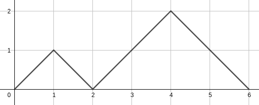
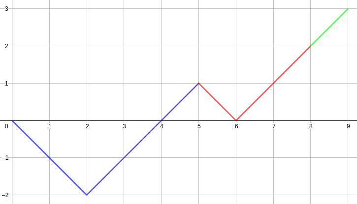

### Subtask 1

我会暴搜！令时间为 $x$、科技水平为 $p$，当 $x\ge k+n$ 和 $x-p>n$ 时剪枝即可。

### Subtask 2

我会 dp！

考虑对每个 $t$ 分别解决。记 $f_{i,j}$ 为当前过了 $i$ 年，科技水平为 $j$，之后所有情况获得的分数总和，则答案为 $f_{0,0}$。显然有转移
$$
f_{i,j}=\begin{cases}
0,&i\ge n+k\\
v_j+\sum_{p=0}^{i+1}f_{i+1,p},&i<n+k\land i-j=t\land j<k\\
\sum_{p=0}^{i+1}f_{i+1,p},&\textrm{otherwise.}
\end{cases}
$$
单次求答案 $O((n+k)^2)$，总时间复杂度 $O(n(n+k)^2)$。

### Subtask 3

当 $t$ 固定时，令仅有的 $w$ 的非零位为 $u$，则我们的答案即为 $[\text{在}(t+u)\text{年后科技水平为}u]$ 的方案总数乘以 $w_u$。记 $i$ 年后科技水平为 $j$ 的方案数为 $g_{i,j}$。我们有一个显然的关系式：
$$
g_{i,j}=g_{i-1,j-1}+g_{i,j+1}
$$
表示当前可能是前半年科技水平提高 $1$ 转移过来或者是科技水平降低转移过来。最终的结论是
$$
g_{i,j}=\frac{j+1}{i+1}\binom{2i-j}i
$$
考虑归纳证明。首先显然 $g_{n,n}=1$，于是对于 $j<i$，我们有
$$
\begin{aligned}
g_{i,j}&=g_{i-1,j-1}+g_{i,j+1}\\
&=\frac ji\binom{2i-j-1}{i-1}+\frac{j+2}{i+1}\binom{2i-j-1}i\\
&=\left(\frac ji\cdot\frac i{2i-j}+\frac{j+2}{i+1}\cdot\frac{i-j}{2i-j}\right)\binom{2i-j}i\\
&=\frac{j+1}{i+1}\binom{2i-j}i
\end{aligned}
$$
于是我们就可以直接 $O(n)$ 计算了。

实际上 $C_m(n,k)=g_{n,n-k}$ 就是广义卡特兰数，意义是 $n$ 个左括号和 $k$ 个右括号组成的字符串，且这个字符串是某个合法括号序列前缀的字符串方案数。

### Subtask 4

于是我们是要计算
$$
\sum_{i=0}^{k-1}g_{t+i,i}=\sum_{i=0}^{k-1}\frac{i+1}{t+i+1}\binom{2t+i}{t+i}
$$
貌似不是很能直接卷积。考虑上面提到的广义卡特兰数，实际上它还有另外一个意义
$$
C_m(n+k-1,k-1)=[x^n]C^k(x)
$$
其中 $C(x)$ 为卡特兰数的生成函数。为什么呢？观察一条在二维直角坐标系上从 $(0,0)$ 开始行走若干时刻，每一步可以选择向右上或右下行走的路径，如下图：

$[x^n]C^k(x)$ 代表着走了 $2n+k$ 步，走到的最高 $y$ 坐标为 $k$ 且仅在最后一步达到这个最大值的方案数：按 $[y\text{坐标第一次达到}u,y\text{坐标第一次达到}(u+1))$ 这样（$u\in[0,k)$）把路径分为 $k$ 段，不难发现第 $i$ 段是一条从 $y=i$ 开始行走且仅在最后一步越过 $y=i$ 的路径，而这恰好对应着卡特兰数。分段如下图：

根据反射原则，我们知道行走 $n$ 步，最大 $y$ 坐标大于等于 $r$ 且最终 $y$ 坐标为 $q$（$q\le r$）的路径数为 $N(n,2r-q)$（$N(n,k)$ 代表从 $(0,0)$ 走到 $(n,k)$ 的路径数）。简单相减可知上面提到的方案数为 $N(2n+k-1,2(k-1)-(k-1))-N(2n+k-1,2k-(k-1))$。于是
$$
\begin{aligned}
\ [x^n]C^k(x)&=N(2n+k-1,k-1)-N(2n+k-1,k+1)\\
&=\binom{2n+k-1}{n+k-1}-\binom{2n+k-1}{n+k}\\
&=C_m(n+k-1,k-1)=g_{n+k-1,n}
\end{aligned}
$$
回到上面那个答案的式子。于是我们相当于是在求
$$
[x^t]\sum_{i=1}^kC^i(x)=[x^t]\frac{C^{k+1}(x)-C(x)}{C(x)-1}
$$
后面的东西可以直接多项式快速幂 + 多项式求逆求出来，时间复杂度 $O(n\log n)$，但这个 $\log$ 常数比较大。其实可以考虑用上面推到的 $[x^n]C^k(x)$ 的公式来直接求到 $C^{k+1}(x)$，应该就能过了。

### Subtask 5

延续上面的思路，我们就是要求
$$
[x^t]\sum_{i=1}^kw_{i-1}C^i(x)
$$
不难发现这是多项式复合的形式。假设 $F(x)=\sum_{i=1}^k w_{i-1}x^i$，那么答案就是 $F(C(x))$。如何快速计算这个多项式复合呢？

令 $d_k=C^k(x)$。如果我们能找到 $d_k$ 的一个常系数线性递推，我们就能写出转移矩阵然后分治 $\mathrm{NTT}$。不过可惜出题人并没有发现，因此考虑令 $c_k=(C(x)-1)^k$。我们可以先复合 $F(x)=F(x+1)$ 再复合 $C(x)-1$。不难发现
$$
\begin{aligned}
(C(x)-1)^2&=1+\frac{\sqrt{1-4x}-2}x+\frac{1-\sqrt{1-4x}}{2x^2}\\
&=\left(\frac1x-2\right)\left(\frac{1-\sqrt{1-4x}}{2x}-1\right)-1\\
&=\left(\frac1x-2\right)(C(x)-1)-1
\end{aligned}
$$
于是对于 $k>1$
$$
\begin{aligned}
c_k&=c_{k-2}(C(x)-1)^2\\
&=c_{k-2}\left(\left(\frac1x-2\right)(C(x)-1)-1\right)\\
&=\left(\frac1x-2\right)c_{k-1}-c_{k-2}
\end{aligned}
$$
于是我们就得到了 $[c_{i-1}\ c_i]$ 到 $[c_i\ c_{i+1}]$ 的转移矩阵
$$
M=\begin{bmatrix}
0 & -1\\
1 & \left(\dfrac1x-2\right)
\end{bmatrix}
$$
于是我们就是要求
$$
\left([1\ (C(x)-1)]\times\left(\sum_{i=1}^kM^iw_{i-1}\right)\right)_{0,0}
$$
这个由于 $M^i$ 的元素次数和 $i$ 同阶因此可以直接分治 $\mathrm{NTT}$，于是就做完了。过程中可以令 $t=\frac1x$ 并将 $M$ 中的元素表示为以 $t$ 为主元的多项式，然后最后卷积的时候稍微注意一下即可。得到矩阵是大常数 $O(k\log k)$ 的，最后有一次小常数 $O((n+k)\log(n+k))$ 的卷积，总时间复杂度 $O(k\log k+(n+k)\log(n+k))$。