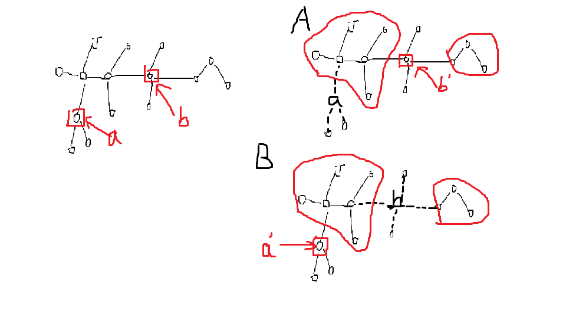
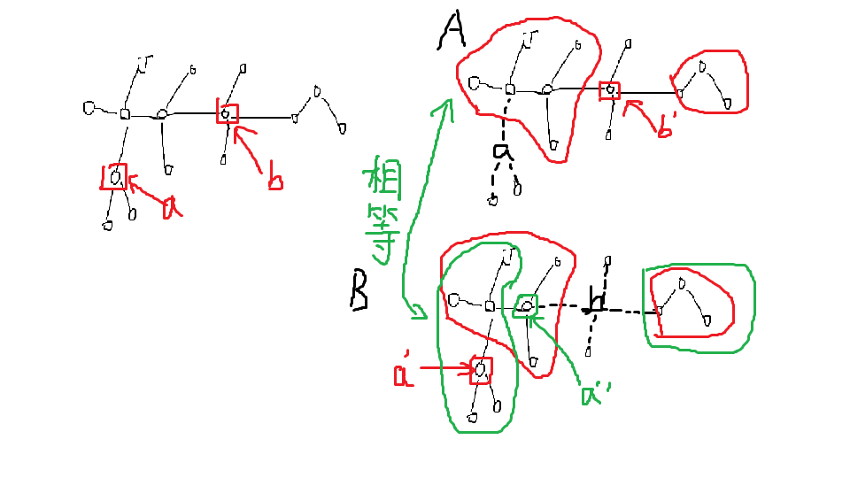
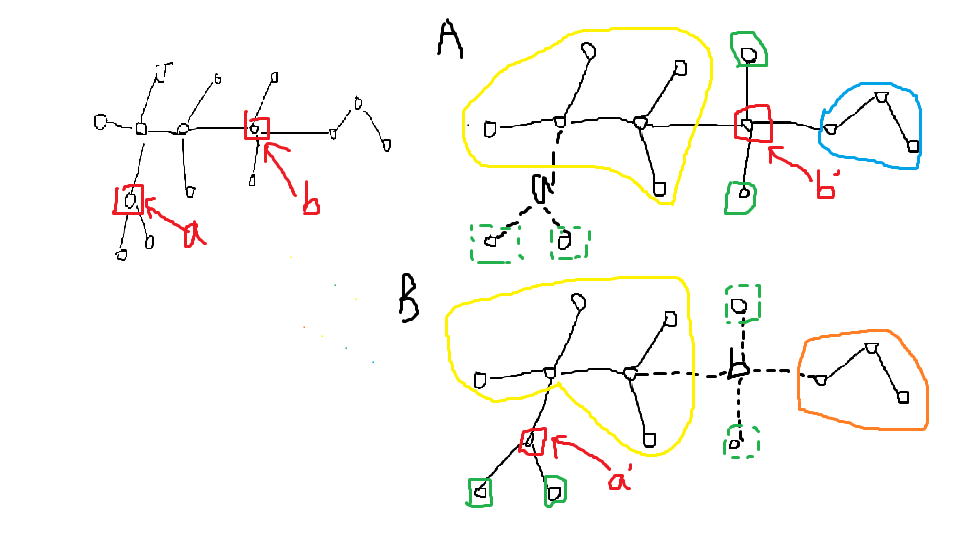
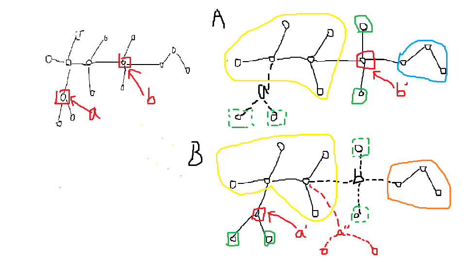

#### Sub1,2

树的形态是确定的，直接构建一条链/一个菊花图即可。

#### Sub3

注意到$n$很小，因此 所有的树的个数很少，可以考虑暴力枚举每一种树加暴力判断。

或者我们考虑暴力枚举删掉的那个点和哪些点相连，然后再暴力判断。

#### Sub4

我们记得到的两个森林分别为$A,B$.

$A$是一棵树，说明在这个部分当中我们删掉了一个叶子节点。

我们可以考虑直接枚举这个叶节点的位置，

那么我们就得到了一个可能是原树的树，然后我们要验证他能不能够选一个点删掉过后变成$B$

我们考虑到可以用树hash来判断两棵树是否同构，时间复杂度是$O(n)$的。

这样我们就有了一个比较暴力的思路。

当我们check这棵树能不能够删一个点然后变成$B$时，考虑暴力枚举删哪个点，时间复杂度$O(n)$,然后我们在用$O(n)$的复杂度把得到的森林的各个树的hash值找出来，和$B$的各个树的hash值比较一下即可。总时间复杂度$O(n^3logn)$（用set/map之类的实现的话）(不知道能不能过)

但是我们发现这个复杂度是可以剪枝的。

我们考虑先枚举删掉的是$A$中哪个点然后在枚举叶子在哪。这样我们每次得到的树只有一棵是在原树基础上加一个点得到，其余保持不变的，那么我们可以先把这些不变的树的hash值预处理出来，先比较一下是否可能成为答案，再去考虑某一棵加上一个叶子的hash值。这样的优化力度是相当大的，可以通过该**Sub**.

#### Sub5

把两部分记为删去$a$后得到的$A$和删去$b$后得到的$B$，我们考虑同时枚举$A$中哪个点是$b$，枚举$B$中哪个点是$a$.

我们首先可以考虑一个做法如下：

枚举出可能是$a$的$a'$和可能是$b$的$b'$，这样我们得到了一些连通块（树），如果这些连通块中大小大于$1$的部分hash相同（两个集合相同），我们就认为找到了正确的$a$和$b$。

看起来很对对！但实际上这个做法是错误的。（但是不知道卡没卡掉）

因为我们忽略了他们之间的相对位置关系，而变成了比较简单的数学关系。

就拿上图举例，我们可能认为$a''$是正确的$a$。

而且这个办法难以构造出方案。

我们考虑把位置关系加进去，我们枚举的每一个点$a'$可能将树划分成几个样子：

其中

绿色表示大小为$1$的连通块（集合），（判断几个即可）

橙色表示“远离”$b$的连通块（集合）（$b$到这个连通块必须先经过$a$）

黄色表示处于$a$和$b$之间的连通块（集合），

蓝色表示$b$到这个连通块不需要经过$a$点的连通块（集合）。

这个样子来比较，就是正确的了。

（即某个$a'$下的（橙色，黄色，蓝色）集合应该等于$b'$下的（蓝色，黄色，橙色）集合，这样就是正确的$a$和$b$）

那么我们是不是对每个点还要枚举一下哪些是橙色，哪些是黄色，哪些是蓝色呢？这个样子状态不是巨多？

其实不用，我们分析一下可以发现，蓝色实际上是确定的，即原本就没有和$a$相连的连通块（集合）。

而剩下的多个连通块中，只有一个是黄色的，我们枚举即可，其余的连通块（集合）即为绿色，总数为$O(n^2)$级别。

这样我们就得到了两个三元组集合（我们把一个连通块集合再做hash），找到两组相同的即可，然后在其基础上构造方案（有了相对位置关系简单很多）。时间复杂度$O(n^2logn)$

那么我们为什么不能还原这棵树呢？看下图：

你发现我们不能够准确判断$a$到底是$a'$还是$a''$，但是这两种情况都符合题意，存在一种方案可以分割出$A$和$B$。

